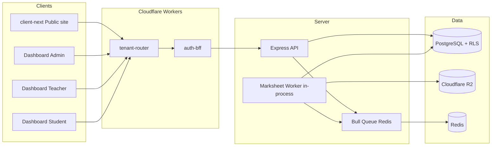

# School Management System

A multi-tenant school management platform: public website, role-based dashboards (admin, teacher, student, super admin), and a Node.js API backed by PostgreSQL. The system covers exams, marks, automated merit lists, marksheet PDFs, attendance SMS, admissions, registration, notices, gallery, and more.

---

## Monorepo layout

Built with **npm workspaces**. Shared packages keep validation and UI consistent across apps.

```
School/
├── server/                 # Express API, Prisma, background workers
├── dashboard/              # Vite + React (admin / teacher / student / super_admin modes)
├── client-next/            # Next.js public school website
├── client/                 # Legacy public client (Vite)
├── workers/
│   ├── auth-bff/           # Cloudflare Worker — auth BFF
│   └── tenant-router/      # Cloudflare Worker — subdomain → tenant routing
├── packages/
│   ├── shared-schemas/     # Zod schemas (frontend + backend)
│   ├── common-ui/          # Shared UI primitives
│   └── client-ui/          # Public-site layout components
├── docker-proxy/           # Local dev reverse proxy
└── server/docs/            # Deep-dive technical docs (e.g. marksheets)
```

### Applications

| App | Purpose | Default dev port |
|-----|---------|------------------|
| **server** | REST API, Prisma, Bull workers, PDF generation | `5000` (see `PORT`) |
| **dashboard** (admin) | School admin panel | `5174` |
| **dashboard** (student) | Student portal | `5175` |
| **dashboard** (teacher) | Teacher portal | `5176` |
| **dashboard** (super_admin) | Platform / multi-school admin | `5177` |
| **client-next** | Public institutional website | `3000` |
| **workers/auth-bff** | Cookie/session edge worker | `8787` |

---

## Architecture



- **Multi-tenant:** Schools are isolated via subdomain routing and Postgres **row-level security (RLS)** (`school_id` context on each request).
- **Source of truth:** Postgres (`marks`, enrollments, exams). R2 and cache tables are disposable PDF cache.
- **Background jobs:** **Bull + Redis** — marksheet PDF queue, SMS, and other async work.

---

## Features

### Academic & results

- **Exams** — create exams, assign classes, upload exam routine PDFs, publish/unpublish (`visible`).
- **Mark entry** — TOTAL or BREAKDOWN (CQ / MCQ / Practical) with validation; teachers limited to assigned sections.
- **View marks** — class grid sorted by subject **priority**; per-student details; download exam PDFs.
- **Merit & promotion** — class merit lists, `final_merit`, auto-promotion fields (`next_year_roll`, `next_year_section`).
- **Public results** — login with student ID + parent phone; **published exams only**.

### Marksheet PDF system (current)

All exam marksheets are rendered **only in a background worker** (PDFKit). HTTP handlers never render inline. Cached PDFs live in **Cloudflare R2** with hash-verified staleness.

| PDF type | Who downloads | Auto background? |
|----------|---------------|-------------------|
| **Per-student exam** | Student, teacher, admin, public | Yes on publish, mark save (**if published**), teacher/head/level change, progress UI gap-fill |
| **Class bundle** | Admin (`ALL`), teacher (section) | On download; auto only on teacher/head/level change |
| **Session student** | Student, teacher, admin | On download only |
| **Session year** | Admin | On download only |

**Publish vs hidden exams**

| Exam state | Save marks | PDF generation |
|------------|------------|----------------|
| **Hidden** (`visible = false`) | Saves to DB only | **On download** (any authorized role) |
| **Published** | Auto-invalidates per-student cache | Normal background + on download |

**Progress UI** — View Marks and Exam PDF Routine poll `GET /api/marks/generation-status/:examId`, show generation progress, and list **outdated bundles** (`bundles.staleItems`) before download.

Full specification: [`server/docs/marksheet-regeneration.md`](server/docs/marksheet-regeneration.md)

### Students & admissions

- Online admission, merit/waiting lists, class 6 / 8 / 9 registration forms (Puppeteer PDFs for form output).
- Student CRUD, photos, fourth subject, alumni transition.

### Operations

- Teachers — profiles, signatures (used on marksheets), class assignments (`levels`).
- Head of institution message and signature on marksheets.
- Syllabus, holidays, citizen charter, class & exam routines.
- Notices with PDF attachments.

### Communication

- SMS — attendance alerts, templates, delivery logs (Bulk SMS API).
- Email — Brevo integration.

### Media

- Events and gallery with student upload + admin approval workflow.

---

## Role-based access

| Capability | Admin | Teacher | Student | Public |
|------------|:-----:|:-------:|:-------:|:------:|
| Manage exams / levels | ✅ | ❌ | ❌ | ❌ |
| Enter / edit marks | ✅ | ✅ (assigned) | ❌ | ❌ |
| View class marks | ✅ | ✅ (assigned) | ❌ | ❌ |
| Download exam marksheet | ✅ | ✅ | ✅ (own) | ✅ (published only) |
| Download class bundle | ✅ | ✅ (section) | ❌ | ❌ |
| Session year PDF | ✅ | ❌ | ❌ | ❌ |
| Publish results | ✅ | ❌ | ❌ | ❌ |
| Attendance / SMS | ✅ | ✅ | ❌ | ❌ |
| Gallery approval | ✅ | ❌ | ❌ | ❌ |

---

## Tech stack

| Layer | Technology |
|-------|------------|
| **Dashboard** | React 19, Vite, TanStack Query, Tailwind 4, shadcn/Radix, Framer Motion |
| **Public site** | Next.js 16, React 19, Tailwind 4 |
| **API** | Node.js, Express (ESM), TypeScript, Zod |
| **Database** | PostgreSQL, Prisma, RLS per school |
| **Queue** | Bull, Redis (ioredis) |
| **Marksheet PDFs** | PDFKit, pdf-to-img rasterization, hash cache on R2 |
| **Other PDFs** | Puppeteer (admission / registration forms) |
| **Storage** | Cloudflare R2 (primary), Cloudinary (images) |
| **Edge** | Cloudflare Workers (tenant routing, auth BFF) |
| **Observability** | Winston, Sentry (optional) |

---

## Getting started

### Prerequisites

- Node.js 20+
- PostgreSQL
- Redis (required for marksheet queue and other Bull jobs)
- Cloudflare R2 credentials (for file storage and marksheet cache)

### Install

```bash
git clone https://github.com/Mutiur03/School.git
cd School
npm install
```

### Environment

Create env files from samples in each app:

| Path | Purpose |
|------|---------|
| `server/.env` | Database, JWT, Redis, R2, SMS, Brevo, Sentry |
| `dashboard/.env.admin` (and `.teacher`, `.student`, `.super_admin`) | API URL, mode-specific config |
| `client-next/.env` | Public site API / analytics |

**Server — required**

```env
DATABASE_URL=postgresql://...
JWT_SECRET=...
```

**Server — marksheets & files**

```env
REDIS_HOST=127.0.0.1
R2_ACCOUNT_ID=...
R2_ACCESS_KEY_ID=...
R2_SECRET_ACCESS_KEY=...
R2_BUCKET_NAME=...
R2_PUBLIC_URL=https://...
```

**Server — optional tuning**

```env
MARKSHEET_WORKER_CONCURRENCY=1
MARKSHEET_SERVE_TIMEOUT_MS=180000
MARKSHEET_SERVE_POLL_MS=500
```

### Database

```bash
cd server
npx prisma generate
npx prisma migrate dev
npm run db:seed
```

Useful maintenance scripts:

```bash
npm run stats:backfill -w server          # exam_class_stats backfill
npm run marksheets:backfill -w server   # pre-queue marksheets (dry: --dry)
```

### Run development

**All services (recommended on Linux/macOS):**

```bash
./run-all.sh
```

Starts server, client-next, shared package watchers, dashboard modes (admin, teacher, super_admin), and auth-bff worker.

**Minimal (root package.json):**

```bash
npm run dev
```

**Individual:**

```bash
npm run dev:server -w server
npm run dev:admin -w dashboard
npm run dev:client-next -w client-next
```

Ensure **Redis is running** before starting the server — the marksheet worker registers on boot.

### Production build

```bash
npm run build
# or separately:
npm run build:server
npm run build:dashboard
npm run build:client:core
```

---

## API overview (marks)

| Method | Path | Auth | Description |
|--------|------|------|-------------|
| `POST` | `/api/marks/addMarks` | admin, teacher | Save marks |
| `GET` | `/api/marks/getClassMarks/:class/:year/:exam` | admin, teacher | Class mark grid |
| `GET` | `/api/marks/:id/:year/:exam/download` | admin, teacher, student | Per-student exam PDF |
| `GET` | `/api/marks/class-exam/:class/:year/:exam/download` | admin, teacher | Class bundle PDF |
| `GET` | `/api/marks/:id/:year/download` | admin, teacher, student | Session student PDF |
| `GET` | `/api/marks/all/:year` | admin | Session year PDF |
| `GET` | `/api/marks/generation-status/:examId` | admin, teacher | Progress + stale bundles |
| `POST` | `/api/marks/public/verify` | public | Public result login |
| `GET` | `/api/marks/public/download` | public token | Published exam PDF |

---

## Documentation

| Document | Contents |
|----------|----------|
| [`server/docs/marksheet-regeneration.md`](server/docs/marksheet-regeneration.md) | PDF types, triggers, hashes, worker flow, progress UI |
| [`dashboard/README.md`](dashboard/README.md) | Dashboard-specific notes |
| [`client-next/README.md`](client-next/README.md) | Public site notes |

---

## Project structure (server highlights)

```
server/src/
├── modules/marks/          # Marks CRUD, marksheet service, worker, queue
├── modules/level/            # Class–teacher assignments
├── modules/teacher/          # Teacher + head signatures
├── controllers/examController.js
├── middlewares/              # Auth, tenant, RLS
└── config/                   # Prisma, R2, Redis, env
```

---

## Demos & contact

- **Live demo:** [Panchbibi School](https://www.mutiurrahman.com/projects/school-management-system)
- **Video walkthrough:** [YouTube](https://www.youtube.com/watch?v=EIk6t_aUbpY)

Developed by **[Mutiur Rahman](https://github.com/Mutiur03)**.
