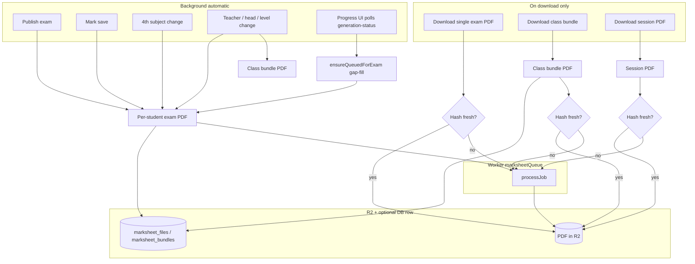
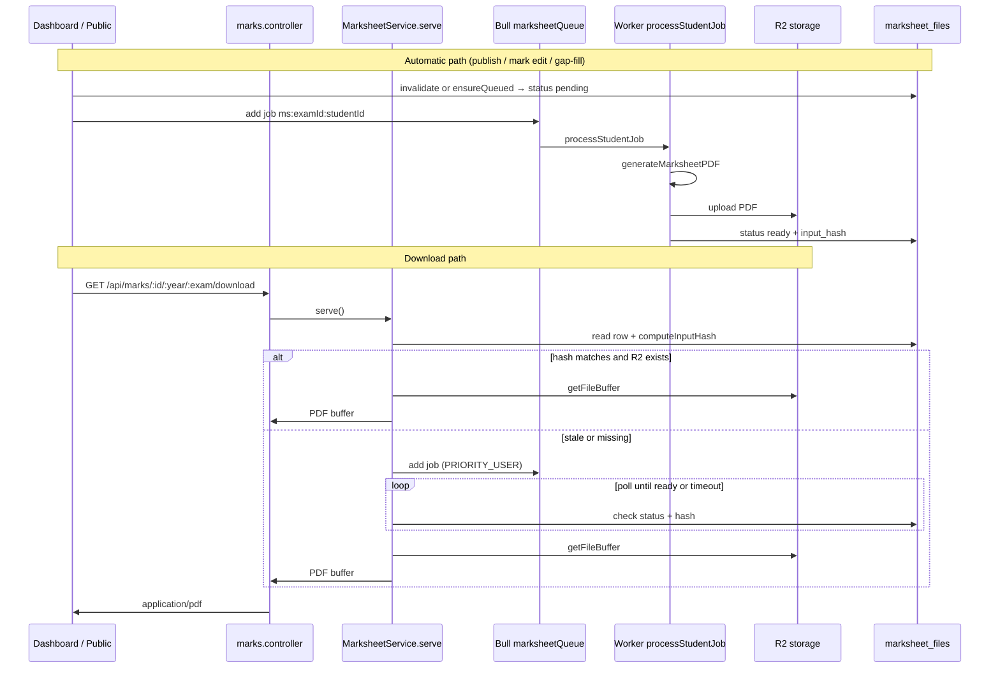
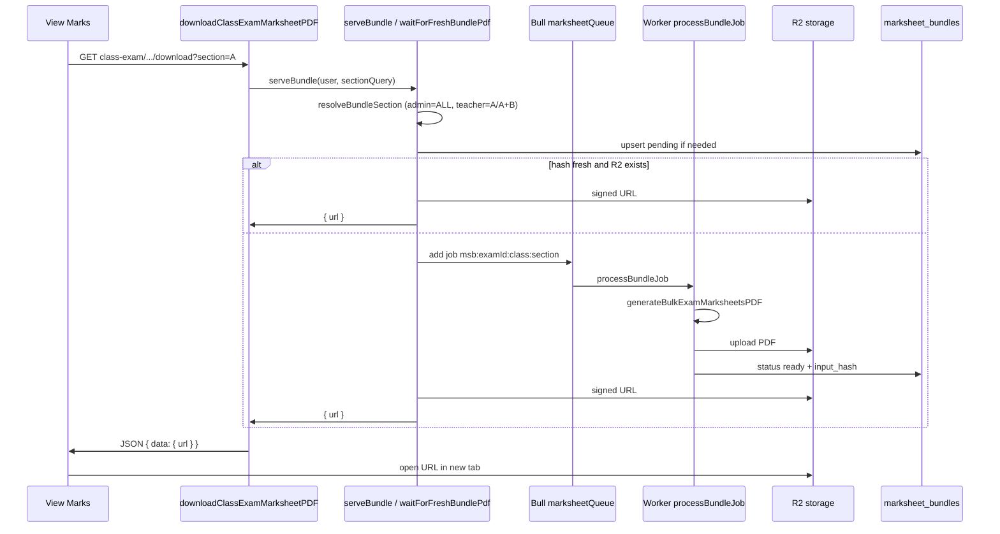
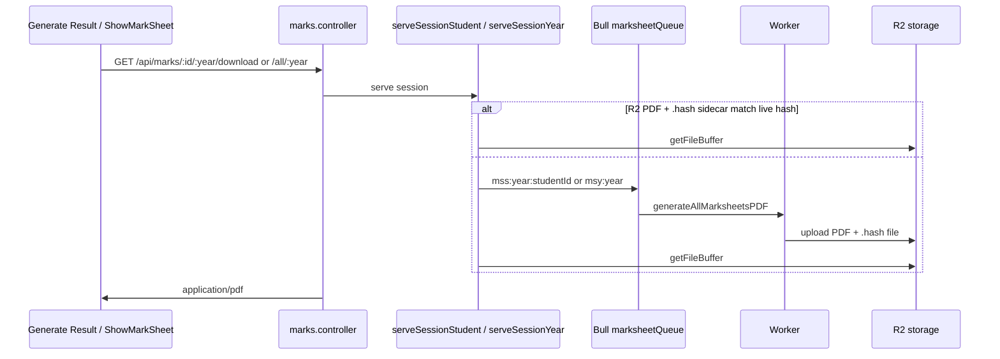
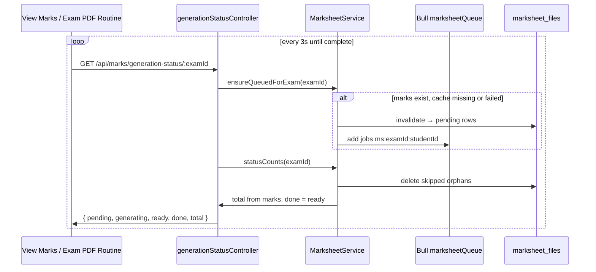

# Marksheet PDF generation — overview

This document describes **all marksheet PDF types**, **when** they are generated, and **how** the worker/cache pipeline works.

**Rules (current):**

- All PDFs are rendered **only in the background worker** (PDFKit). HTTP handlers **never** render inline.
- **Per-student exam PDFs** are pre-generated automatically on publish, mark changes, teacher/head invalidation, and when the **progress UI polls** `generation-status` (gap-fill for empty cache).
- **Class bundles** (admin + teacher) generate **on download** (hash check), except they are **auto-queued** when a class-teacher or head assignment changes.
- **Session PDFs** are generated **on download only**, with hash-verified R2 cache.
- Postgres `marks` is the source of truth. R2 + cache tables are disposable cache.
- **Result-date freeze (personnel-only):** once an exam's `result_date` has passed, its marksheets are **frozen** — a later **head / class-teacher reassignment no longer regenerates or re-stamps them**. Marks and class-highest stay live and still regenerate. See below.

---

## Result-date freeze (personnel-only)

Signatories (head + class teacher) appear on every marksheet, but staff change routinely — a new headmaster, a class teacher reassigned mid-session (different teacher for half-yearly vs annual). A finalized marksheet must keep the people who signed it, not silently adopt whoever is currently assigned.

`isExamFrozen(result_date)` (in `marksheet.service.ts`) is true once `result_date` is strictly in the past (a missing/unparseable date is treated as **open**). For a frozen exam:

- **What is captured:** at generation the worker stores the signatory **ids** on the cache row — `marksheet_files.snapshot_{head_id,head_role,teacher_id}` and `marksheet_bundles.snapshot_{head_id,head_role,teachers}` (`teachers` = `{ "<section>": <teacher_id> }`). Every render (open or frozen) rewrites these, so the last open render becomes the frozen snapshot.
- **Staleness (`computeInputHash` / `computeBundleHash`):** a frozen exam fingerprints the **snapshotted person's current** name/signature (resolved by id), not the current assignment. So a reassignment does **not** flag the sheet stale, but the **same person uploading a signature later does** — it regenerates lazily on next download and shows the new signature.
- **Rendering (`generateMarksheetPDF` / `generateBulkExamMarksheetsPDF`):** the worker passes the snapshotted ids as an override; the render resolves those people (by id, live name/signature) instead of the current assignment. So even a marks correction after `result_date` re-renders with the original signatories.
- **Invalidation:** `invalidateForSchoolSignatureChange` (head change) and `invalidateForClassSection` (class-teacher change) **skip frozen exams**, so a routine staff change no longer mass-regenerates the school's history. Marks-driven invalidation is unaffected.

**Known limitation:** whole-**session** PDFs (types 3–4) have no cache row to anchor a snapshot; they still render the current assignment. They are on-download-only bulk exports and are not mass-regenerated by a staff change.

---

## PDF types at a glance

| # | PDF | Who downloads | Cache table | R2 path pattern |
|---|-----|---------------|-------------|-----------------|
| 1 | **Per-student exam** | Student, teacher, admin, public | `marksheet_files` | `{school}/marksheets/{year}/{examId}/{studentId}.pdf` |
| 2 | **Class bundle** | Admin (`ALL`), teacher (section) | `marksheet_bundles` | `{school}/marksheets/{year}/bundles/{examId}/class-{class}-{section}.pdf` |
| 3 | **Session student** | Student, teacher, admin | *(none)* | `{school}/marksheets/{year}/session/student-{studentId}.pdf` |
| 4 | **Session year** | Admin only | *(none)* | `{school}/marksheets/{year}/session/all.pdf` |

**Renderer functions** (worker only):

| PDF | Code |
|-----|------|
| Per-student exam | `MarksService.generateMarksheetPDF()` → `renderStudentReportPDF()` |
| Class bundle | `MarksService.generateBulkExamMarksheetsPDF()` (one doc, page per student) |
| Session (both) | `MarksService.generateAllMarksheetsPDF()` |

---

## What triggers what (master reference)

This section answers: **when is PDF generation automatically triggered**, and **which change triggers which PDF type**.

Legend: **✅ Auto** = background worker queued without a download. **❌ No** = not auto-queued (may still run **on download** if hash is stale). **On download** = only when someone hits a download endpoint.

### Master trigger table

| Change / event | Per-student exam | Class bundle | Session student | Session year |
|----------------|------------------|--------------|-----------------|----------------|
| **Publish exam** (`visible = true`) | ✅ Auto | ❌ No | ❌ No | ❌ No |
| **Save marks** (only some students changed) | ✅ Auto **if published** | ❌ No* | ❌ No | ❌ No |
| **Save marks** (class-highest changed) | ✅ Auto **if published** (whole class) | ❌ No* | ❌ No | ❌ No |
| **4th subject changed** | ✅ Auto **if exam published** | ❌ No* | ❌ No* | ❌ No* |
| **Level create / update / delete** (class teacher) | ✅ Auto (students in section) | ✅ Auto (`section`, `ALL`, `A+B`) | ❌ No | ❌ No |
| **Teacher name changed** | ✅ Auto (their sections) | ✅ Auto (same) | ❌ No | ❌ No |
| **Teacher signature changed** | ✅ Auto | ✅ Auto | ❌ No | ❌ No |
| **Head teacher / role changed** | ✅ Auto (whole school) | ✅ Auto (whole school) | ❌ No | ❌ No |
| **Progress UI poll** (View Marks / Exam PDF Routine) | ✅ Auto if cache empty / `failed` **and exam published** | ❌ No | ❌ No | ❌ No |
| **Server restart** | ✅ Re-queues `pending` only | ✅ Re-queues `pending` bundles | ❌ No | ❌ No |
| **Anyone downloads** | ✅ If missing / stale | ✅ If missing / stale | ✅ If missing / stale | ✅ If missing / stale |

\*Not auto-queued, but the dashboard shows them as **outdated** (`bundles.staleItems`); download regenerates from current marks.

### Quick mental model

```
AUTOMATIC (background worker):
  Publish              → per-student exam PDFs only
  Mark save            → per-student only when exam.visible = true
  4th subject          → per-student only for published exams in that year
  Teacher / head / level → per-student + class bundles (affected scopes)
  Progress UI poll     → per-student gap-fill only when exam is published

ON DOWNLOAD ONLY (any visibility):
  Unpublished exam     → per-student / bundle / session PDFs on request (hash check)
  Class bundle         → after mark edits on published exams (unless teacher/head/level changed)
  Session PDFs         → always (first time and when hash stale)
  Any PDF type         → whenever cache is missing or hash does not match live data
```

---

### Automatic triggers (detailed)

These **queue Bull jobs** without anyone downloading.

#### 1. Publish exam

| | |
|---|---|
| **Where** | Exam PDF Routine → toggle **Published** |
| **Code** | `enqueueForExam()` in `examController.js` |
| **PDFs** | Per-student only — every student with non-null marks |
| **Bundles** | Not pre-warmed |

#### 2. Save marks (`addMarks`)

| | |
|---|---|
| **Where** | Enter marks screen |
| **Published** (`exam.visible = true`) | Class-highest changed → `invalidateClasses()` → whole class; else → `invalidate(changedStudentIds)` |
| **Unpublished** | Marks saved to DB only — **no** `invalidate`, **no** background PDF work |
| **On download** | `serve()` hash check queues worker if stale/missing (works before or after publish) |
| **Bundles** | Not invalidated on mark save — hash checked on next download |

#### 3. 4th subject change

| | |
|---|---|
| **Where** | Student fourth-subject update |
| **Code** | `updateFourthSubject` → `invalidate([studentId])` for each **published** exam in that year |
| **Unpublished exams** | No auto-invalidation — PDF refreshes on download |

#### 4. Class-teacher assignment (levels)

| | |
|---|---|
| **Where** | Level create / update / delete (`level.service.ts`) |
| **Code** | `invalidateForClassSection(class, section, year)` |
| **Per-student** | Students in that section who have marks |
| **Bundles** | `section`, `ALL`, and matching `A+B` keys |

#### 5. Teacher profile

| | |
|---|---|
| **Name change** | `invalidateForTeacherProfile(teacherId)` — all sections that teacher teaches |
| **Signature change** | Same (`teacher.service.ts`) |
| **PDFs** | Per-student + bundles for affected sections |

#### 6. Head teacher / head role

| | |
|---|---|
| **Where** | School head settings (`teacher.service.ts`) |
| **Code** | `invalidateForSchoolSignatureChange(schoolId)` |
| **PDFs** | All per-student sheets + all bundles for that school |

#### 7. Progress UI poll (gap-fill)

| | |
|---|---|
| **Where** | View Marks or Exam PDF Routine polls `GET /api/marks/generation-status/:examId` |
| **Code** | `ensureQueuedForExam()` before returning counts |
| **When** | Marks exist, exam is **published**, and `marksheet_files` is empty or rows are `failed` |
| **PDFs** | Per-student only |

#### 8. Server restart

| | |
|---|---|
| **Code** | `recover()` in `marksheet.worker.ts` on startup |
| **Re-queues** | Rows still `pending`, or stuck `generating` → reset to `pending` |
| **Does not** | Gap-fill missing rows (needs publish, progress poll, or download) |

---

### On-download triggers (not automatic)

These run **only when someone hits a download endpoint** and the stored hash says the file is missing or stale.

| PDF | Endpoint | Who |
|-----|----------|-----|
| Per-student exam | `GET /api/marks/:id/:year/:exam/download` | Student, teacher, admin, public |
| Class bundle | `GET /api/marks/class-exam/:class/:year/:exam/download` | Admin (`ALL`), teacher (section) |
| Session student | `GET /api/marks/:id/:year/download` | Student, teacher, admin |
| Session year | `GET /api/marks/all/:year` | Admin |

**Flow:** compute live hash → compare to cache → fresh? serve R2 → stale/missing? queue worker → poll (up to `MARKSHEET_SERVE_TIMEOUT_MS`) → serve R2.

**Mark edits** do **not** auto-regenerate bundles or session PDFs — the UI lists outdated bundles in `bundles.staleItems`; download regenerates.

---

### What does **not** auto-trigger

| Event | Why |
|-------|-----|
| Hiding / unpublishing an exam | No invalidation or regeneration |
| Editing exam name or routine PDF upload | Not marksheet render input |
| Signature image replaced at same R2 path without DB change | Hash uses DB paths only |
| Bundle after **mark-only** edit | Stale until download (UI shows outdated list) |
| Session PDF after publish or mark save | On download only |
| Save marks on **unpublished** exam | No invalidation; PDF on download only |
| Save marks on **published** exam | Normal invalidate flow |

---

## When each PDF is generated

### Per-student exam PDF — **automatic + on download**

| Trigger | Background queue? | Notes |
|---------|-------------------|-------|
| **Publish exam** | Yes | `enqueueForExam()` — all students with non-null marks |
| **Save marks** (student changed, class-highest unchanged) | Yes **if published** | `invalidate(changedStudentIds)` |
| **Save marks** (class-highest values changed) | Yes **if published** | `invalidateClasses()` — whole class |
| **4th subject changed** | Yes **if exam published** | `invalidate([studentId])` for each published exam in that year |
| **Teacher / head / level assignment change** | Yes | `invalidateForClassSection` / `invalidateForTeacherProfile` / `invalidateForSchoolSignatureChange` |
| **Progress UI poll** | Yes **if published** | `ensureQueuedForExam()` — gap-fill when marks exist but cache is empty or `failed` |
| **Server restart** | Yes | `recover()` re-queues rows still `pending` |
| **Download** | If needed | `serve()` → hash check → wait for worker if stale |

**Endpoint:** `GET /api/marks/:id/:year/:exam/download`

---

### Class bundle PDF — **on download** (+ teacher/head auto-queue)

Admin whole-class (`section: "ALL"`) and teacher section bundles (`A`, `A+B`, …) use the **same pipeline**; only the cache key differs.

| Trigger | Background queue? | Notes |
|---------|-------------------|-------|
| **Publish exam** | **No** | Bundles are not pre-warmed |
| **Mark edits** (any) | **No** | Staleness detected at download via hash |
| **Class-teacher / head / level change** | **Yes** | `invalidateBundlesForClassSection` — `section`, `ALL`, matching `A+B` |
| **Download** | Yes | `serveBundle()` → `waitForFreshBundlePdf()` |

| Role | `bundleSection` key | PDF contents |
|------|---------------------|--------------|
| Admin | `ALL` | Entire class, all sections |
| Teacher (one section filter) | e.g. `A` | That section only |
| Teacher (no filter, multiple assignments) | e.g. `A+B` | All assigned sections |

**Endpoint:** `GET /api/marks/class-exam/:class/:year/:exam/download?section=A`

**UI:** View Marks → “Download All Exam PDFs”

---

### Session student PDF — **on download only**

| Trigger | Background queue? |
|---------|-------------------|
| Publish / mark edits | **No** |
| **Download** | Yes if hash stale or missing |

**Endpoint:** `GET /api/marks/:id/:year/download`

---

### Session year PDF — **on download only**

| Trigger | Background queue? |
|---------|-------------------|
| Publish / mark edits | **No** |
| **Download** | Yes if hash stale or missing |

**Endpoint:** `GET /api/marks/all/:year` (Generate Result page)

---

## High-level flow (all PDF types)



### ASCII fallback (if Mermaid does not render)

```
AUTOMATIC (background):
  Publish / mark edit / 4th subject / teacher-head-level change
       → per-student exam PDF
       → marksheet_files pending → worker → R2

  Teacher-head-level change (bundles only)
       → class bundle PDF for section + ALL + matching A+B

  Progress UI polls GET /api/marks/generation-status/:examId
       → ensureQueuedForExam() if marks exist but cache empty/failed
       → same per-student pipeline as publish

ON DOWNLOAD:
  Any download endpoint
       → compute hash vs cache
       → fresh? serve R2
       → stale? queue worker → wait → serve R2

  Class bundle / session PDFs → not auto-queued on publish or mark edit
  (bundles except teacher/head/level invalidation)
```

---

## Per-student exam — detailed flow



---

## Class bundle — detailed flow



**Important:** Bundles are **not** queued on publish or mark save. Mark edits make the hash stale; the next download regenerates. **Exception:** class-teacher, head, or level assignment changes auto-queue bundles for the affected section keys.

---

## Session PDFs — detailed flow



No `marksheet_files` / `marksheet_bundles` row. No dashboard progress bar.

---

## Cache tables

### `marksheet_files` (per student + exam)

| Column | Purpose |
|--------|---------|
| `status` | `pending` \| `generating` \| `ready` \| `failed` \| `skipped` (legacy; cleaned on status poll) |
| `r2_key` | Path to cached PDF in R2 |
| `input_hash` | SHA-256 fingerprint of render inputs |
| `student_name` | Download filename |

### `marksheet_bundles` (class + exam + section scope)

Same status semantics. Unique key: `(exam_id, class, section)`.

- `section = "ALL"` — admin whole class
- `section = "A"` or `"A+B"` — teacher scope

Rows are created on **first bundle download**, not on publish.

### Session PDFs

Stored in R2 only. Staleness via companion file `{pdfKey}.hash`.

---

## Input fingerprints (staleness)

### Per-student — `computeInputHash`

| Field | Source |
|-------|--------|
| `n` | Mark row count for student |
| `m` | Latest `marks.updated_at` |
| `s` | `exam_class_stats.updated_at` (class-highest) |
| `h` | Head message: `head_id`, `updated_at`, `head_role`, head teacher name + signature path |
| `t` | Class teacher (`levels` for student's class+section+year): `teacher_id`, name, signature path |
| `f` | `fourth_subject_id` |
| `r` | Roll |
| `sec` | Section |

### Bundle — `computeBundleHash`

Includes `sec` (bundle section key), class-scoped mark aggregate (`n`, `m`), class stats (`s`), head (`h`), and **all class-teacher rows** in bundle scope (`t` — one section, multiple sections, or whole class for `ALL`).

### Session — `computeSessionStudentHash` / `computeSessionYearHash`

Same head (`h`) and class-teacher data (`t` for student's section, or all `levels` for the year on admin session PDF).

**Still not detected:** signature **image file** replaced in R2 at the **same path** without changing `teachers.signature` or `head_msg`.

---

## Bull queue job IDs

| Pattern | PDF type |
|---------|----------|
| `ms:{examId}:{studentId}` | Per-student exam |
| `msb:{examId}:{class}:{section}` | Class bundle |
| `mss:{year}:{studentId}` | Session student |
| `msy:{year}` | Session year |

Concurrency: `MARKSHEET_WORKER_CONCURRENCY` (default `1`).

Serve timeout while waiting: `MARKSHEET_SERVE_TIMEOUT_MS` (default `180000`).

---

## Mark edit → invalidation (per-student only)

**Teacher / head changes also auto-queue** (see below).

**File:** `server/src/modules/marks/marks.service.ts` — `addMarks`

```
1. Only upsert marks that actually changed (markRowChanged)
2. Recompute exam_class_stats per affected class
3. IF exam.visible = false → skip marksheet invalidation (PDFs on download only)
4. IF published AND class-highest VALUES changed → invalidateClasses (whole class students)
   Else IF published AND students changed → invalidate(changedStudentIds) only
5. Bundles are NOT invalidated here — hash check on next download
```

| Edit scenario | Per-student auto queue? | Bundle |
|---------------|-------------------------|--------|
| One student, class-highest unchanged (**published**) | That student only | On next download |
| Class-highest changed (**published**) | Whole class | On next download |
| Any mark edit (**unpublished**) | Nobody | On next download |
| Class-teacher / head / signature change | Section students (or whole school) | **Auto-queue** section + `ALL` + matching `A+B` |
| No value changes | Nobody | — |

**4th subject:** `updateFourthSubject` → `invalidate([studentId])` for all exams in that year.

### Teacher / head → auto-queue

| Trigger | What re-queues |
|---------|----------------|
| **Level create/update/delete** | Students in section + bundles (`section`, `ALL`, matching `A+B`) |
| **Teacher name change** | All sections that teacher is assigned to |
| **Teacher signature change** | Same |
| **Head teacher or role change** | All marksheets + bundles for the school |

**Files:** `level.service.ts`, `teacher.service.ts` → `MarksheetService.invalidateForClassSection` / `invalidateForTeacherProfile` / `invalidateForSchoolSignatureChange`

`invalidate` and `invalidateForClassSection` only queue students who have **non-null marks** for the exam — avoids inflating progress with students who have no marks.

---

## Worker: regenerate, skip, or defer

```
1. Claim row: pending/failed → generating
2. hashAtStart = compute hash
3. IF hash matches stored hash AND R2 exists
     → check concurrent staleness → SKIP or DEFER
   ELSE
     → render PDF, upload R2
4. IF hash changed mid-render OR row no longer generating
     → DEFER: pending + re-queue after job completes
   ELSE
     → ready + save hash
```

**No marks for student:** worker **deletes** the `marksheet_files` row (does not leave `skipped`). Only students with real marks are ever queued (`invalidate` filters by marks table).

**Orphan `skipped` rows:** `statusCounts()` deletes any `skipped` student rows on each poll so progress totals stay accurate.

Prevents a finished worker from promoting a stale PDF when a second edit happens mid-render.

---

## Progress UI

| What | Where |
|------|-------|
| Per-student + bundle DB status | `GET /api/marks/generation-status/:examId` |
| Dashboard bars | Exam PDF Routine, View Marks (`MarksheetGenProgress`) |
| Session PDFs | No UI — server logs `[marksheet]` only |

### Generation-status workflow

Each poll runs **before** counts are returned:

```
1. ensureQueuedForExam(examId)
     → students with marks but no row, or status failed
     → invalidate(needQueue) → pending rows + Bull jobs
2. statusCounts(examId)
     → delete orphan skipped rows
     → students.total = count from marks table (not raw DB row count)
     → students.done = ready count only
     → bundles.stale + bundles.staleItems (hash mismatch on ready rows)
     → bundles.done = ready minus stale
3. Return JSON to dashboard (poll every 3s until complete)
```

**Why gap-fill exists:** If `marksheet_files` is empty (DB wipe, never published, fresh deploy) but `marks` has data, polling alone used to show `0/N ready` with **no jobs queued**. Opening View Marks or Exam PDF Routine now starts generation automatically.

**Complete when** (`isMarksheetGenComplete`):

- Students: `done >= total` and `pending === 0` and `generating === 0`
- Bundles (if any rows exist): `pending === 0` and `generating === 0` only — **stale bundles do not block** (they refresh on download)

**Stale bundle preview** (`bundles.staleItems`):

- API returns `{ class, section }[]` for each outdated ready bundle
- **View Marks** — amber box above “Download All Exam PDFs” when generation is complete but bundles are stale (filtered to selected class/section)
- **Exam PDF Routine** — per-exam list under compact progress bar
- Labels: `Class 10 (all sections)`, `Class 10 (A)`, `Class 10 (A+B)`, etc.

Bundle rows in `generation-status` only appear **after** at least one bundle download or teacher/head invalidation created a `marksheet_bundles` row.



---

## Download endpoints summary

| PDF | Endpoint | Response |
|-----|----------|----------|
| Per-student exam | `GET /api/marks/:id/:year/:exam/download` | PDF bytes |
| Class bundle | `GET /api/marks/class-exam/:class/:year/:exam/download` | JSON `{ url }` |
| Session student | `GET /api/marks/:id/:year/download` | PDF bytes |
| Session year | `GET /api/marks/all/:year` | PDF bytes |
| Public exam | `GET /api/marks/public/download?year=&exam=` | PDF bytes |

---

## Key files

| File | Role |
|------|------|
| `server/src/modules/marks/marksheet.service.ts` | Serve, hash, invalidate, `ensureQueuedForExam`, worker jobs |
| `server/src/modules/marks/marksheet.queue.ts` | Bull queue, job IDs |
| `server/src/modules/marks/marksheet.worker.ts` | In-process worker + recovery |
| `server/src/modules/marks/marks.service.ts` | PDF render + `addMarks` invalidation |
| `server/src/controllers/examController.js` | Publish → `enqueueForExam` (students only) |
| `server/src/modules/marks/marks.controller.ts` | Download + generation-status |
| `dashboard/src/components/MarksheetGenProgress.tsx` | Progress UI + bundle stale list |
| `dashboard/src/components/BundleStalePreview.tsx` | Stale bundle preview (View Marks, Exam PDF Routine) |
| `dashboard/src/pages/Admin/ViewMarks.tsx` | Download all + progress |
| `dashboard/src/pages/Admin/ExamPDFRoutine.tsx` | Publish + per-exam progress |
| `dashboard/src/queries/marks.queries.ts` | `useMarksheetGenerationStatus`, `isMarksheetGenComplete` |

---

## Quick reference

| Question | Answer |
|----------|--------|
| What auto-generates on publish? | **Per-student exam PDFs only** |
| What auto-generates on mark edit? | **Per-student** if exam **published** (or whole class if class-highest changed) |
| Save marks while exam hidden? | **No** auto-invalidation — PDF on **download** only |
| What auto-generates on teacher/head/level change? | **Per-student + class bundles** (affected scopes) |
| What auto-generates on progress UI poll? | **Per-student gap-fill** (`ensureQueuedForExam`) |
| Empty cache but marks exist — who starts jobs? | **Progress UI poll** → `ensureQueuedForExam` (View Marks / Exam PDF Routine) |
| When do bundles generate? | **On download** (hash stale), or **auto** on teacher/head/level change |
| How to see outdated bundles before download? | **`bundles.staleItems`** in generation-status + `BundleStalePreview` UI |
| When do session PDFs generate? | **On download only** |
| What does server restart re-queue? | **`pending`** student + bundle rows only (not gap-fill, not `failed`) |
| How is progress `total` calculated? | **Students with marks** in `marks` table — not raw `marksheet_files` row count |
| Teacher vs admin bundle? | Same worker path; different `section` cache key |
| Inline PDF on download? | **Never** — worker + R2 always |
| Source of truth? | Postgres `marks`; R2 is cache |
