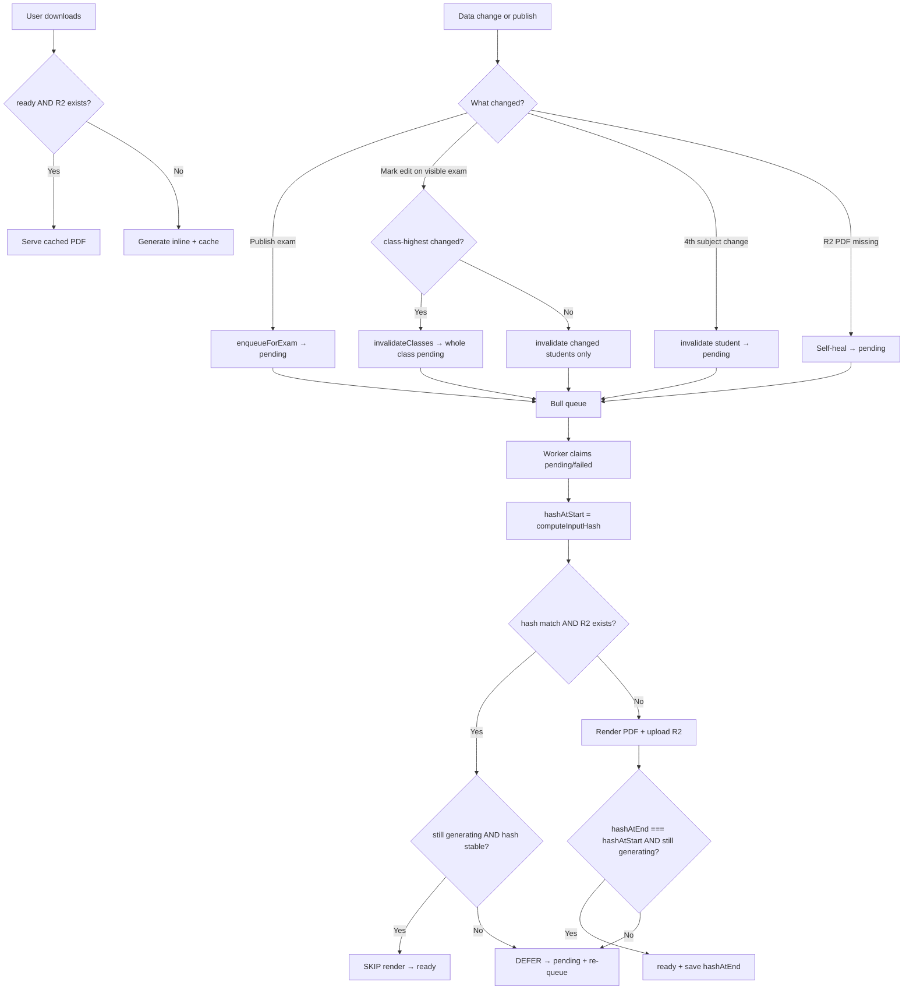

# Marksheet regeneration — how it works

This document explains when the system decides a marksheet needs to be regenerated, when the background worker actually re-renders the PDF, and how concurrent mark edits are handled.

The system uses a **two-layer model**:

1. **Staleness (DB status)** — something changed, so the row is marked `pending` and a job is queued.
2. **Smart skip (input fingerprint)** — the worker compares a hash of render inputs; if nothing changed and the R2 file still exists, it skips the expensive PDF render.

Postgres marks are the **source of truth**. R2 PDFs and `marksheet_files` / `marksheet_bundles` rows are **cache only**.

---

## Cache tables

### `marksheet_files` (per student + exam)

| Column | Purpose |
|--------|---------|
| `status` | `pending` \| `generating` \| `ready` \| `failed` \| `skipped` |
| `r2_key` | Path to the cached PDF in R2 |
| `input_hash` | SHA-256 fingerprint of everything that affects the rendered PDF |
| `student_name` | Used for download filename when serving from cache |

Source: `server/prisma/schema.prisma` — `marksheet_files` model.

### `marksheet_bundles` (whole-class PDF per exam)

Same semantics as `marksheet_files`, but one row per `(exam_id, class, section="ALL")`.

- **Cached:** admin full-class download only.
- **Not cached:** teacher section-filtered views (always generated inline).

### `exam_class_stats` (class-highest cache)

| Column | Purpose |
|--------|---------|
| `highest_by_subject` | Max mark per subject in the class |
| `class_highest_total` | Max per-student total (exam-type subjects) |
| `class_highest_grand_total` | Max per-student total (all subjects) |
| `updated_at` | Part of marksheet `input_hash` fingerprint |

Recomputed inside the `addMarks` transaction. `updated_at` is only bumped when the **displayed values** actually change.

---

## When a marksheet is marked stale (`status = pending`)

These events flip cache rows to `pending` and enqueue a Bull job on `marksheetQueue`.

### 1. Exam is published

When an exam is made visible, all student marksheets and class bundles are pre-warmed in the background.

**File:** `server/src/controllers/examController.js`

```js
if (visible && result) {
  pregen = await MarksheetService.enqueueForExam(result.id, result.school_id, result.exam_name);
  await MarksheetService.enqueueBundlesForExam(result.id, result.school_id, result.exam_name);
}
```

**File:** `server/src/modules/marks/marksheet.service.ts` — `enqueueForExam`

- Finds every student with at least one non-null mark for the exam.
- Upserts `marksheet_files` with `status: "pending"`.
- Pushes one job per student (deduped by `jobId`).

### 2. Marks edited after publish (smart invalidation)

When marks are saved on a **published** exam (`exam.visible`), invalidation scope depends on whether **class-highest values** changed.

**File:** `server/src/modules/marks/marks.service.ts` — `addMarks`

```
1. Compare submitted marks against DB → only upsert rows that actually changed
2. Recompute exam_class_stats per affected class
3. If class-highest VALUES changed  → invalidateClasses (whole class + bundle)
   Else if only student marks changed → invalidate(changedStudentIds) only
```

```ts
if (classesWithStatsChange.length > 0) {
  await MarksheetService.invalidateClasses(exam.id, classesWithStatsChange, yearInt);
} else if (changedStudentIds.length > 0) {
  await MarksheetService.invalidate(changedStudentIds, exam.id);
}
```

| Edit scenario | Who gets `pending` |
|---------------|-------------------|
| One student's mark, class-highest unchanged | **That student only** |
| Mark change shifts class-highest (new top score, etc.) | **Whole class** + class bundle |
| No actual value changes | **Nobody** (no DB write, no invalidation) |

**Why whole class when class-highest changes?** Class-highest figures are printed on every marksheet in that class. One student's mark can change what appears on all classmates' PDFs.

**File:** `server/src/modules/marks/marksheet.service.ts`

- `invalidate(studentIds, examId)` — sets `pending` + re-enqueues those students.
- `invalidateClasses(examId, classes, year)` — resolves all students in those classes, calls `invalidate`, then `invalidateBundles`.

### 3. Mark form — only changed students submitted

**File:** `dashboard/src/pages/Admin/AddMarks.tsx`

The mark form tracks **dirty** students (cells actually edited). Submit sends only those students to `/api/marks/addMarks`, not the entire class roster.

```ts
const studentsToSubmit = filteredStudents.filter((s) =>
  dirtyStudentIds.has(s.student_id),
);
```

This pairs with the server-side `markRowChanged` filter so one edit does not touch every student's `marks.updated_at`.

### 4. Fourth subject changed

Changing a student's fourth subject changes what appears on their marksheet.

**File:** `server/src/modules/marks/marks.service.ts` — `updateFourthSubject`

- Finds all **published** exams for that enrollment/year.
- Calls `MarksheetService.invalidate([studentId], exam_id)` for each.

### 5. R2 object missing (self-heal)

If the DB row says `ready` but the PDF is gone from R2 (lifecycle rule, manual delete, bucket wipe), the serve path flips the row back to `pending` and regenerates.

**File:** `server/src/modules/marks/marksheet.service.ts` — `serve` / `serveBundle`

```ts
if (row?.status === "ready" && row.r2_key) {
  const buf = await getFileBuffer(row.r2_key);
  if (buf) return { buffer: buf, studentName: row.student_name };
  // missing → self-heal
  await prisma.marksheet_files.update({
    where: { id: row.id },
    data: { status: "pending", r2_key: null },
  });
}
```

Batch reconciliation: `reconcileExam()` (intended for nightly cron).

### 6. Server restart recovery

**File:** `server/src/modules/marks/marksheet.worker.ts` → `MarksheetService.recover`

- Rows stuck in `generating` (worker died mid-job) → reset to `pending`.
- All `pending` rows → re-enqueued on startup.

---

## Input fingerprint (`input_hash`)

Before rendering, the worker computes a hash of everything that changes the PDF.

**File:** `server/src/modules/marks/marksheet.service.ts` — `computeInputHash`

| Fingerprint field | Source | What it captures |
|-------------------|--------|------------------|
| `n` | `marks` aggregate `_count` | Number of mark rows for this student |
| `m` | `marks` aggregate `_max.updated_at` | Latest mark edit timestamp |
| `s` | `exam_class_stats.updated_at` | Class-highest cache (shared per class) |
| `h` | `head_msg.updated_at` (latest) | Head message on the sheet |
| `f` | `enrollment.fourth_subject_id` | Fourth subject |
| `r` | `enrollment.roll` | Roll number |
| `sec` | `enrollment.section` | Section |

The JSON fingerprint is SHA-256 hashed and stored as `input_hash` when a PDF is successfully cached.

**Not included in the hash:** teacher/head **signature image file** swaps. Those require explicit invalidation (not automatic today).

Class bundles use `computeBundleHash` at class scope (`n`, `m`, `s`, `h` only).

---

## Bull queue

**File:** `server/src/modules/marks/marksheet.queue.ts`

| Job ID pattern | Target |
|----------------|--------|
| `ms:{examId}:{studentId}` | Per-student marksheet |
| `msb:{examId}:{class}` | Whole-class bundle |

Bull **deduplicates** by `jobId`: if a job with the same ID is already waiting or active, a duplicate is not added. This matters during concurrent mark edits (see below).

Default worker concurrency: `MARKSHEET_WORKER_CONCURRENCY` (default `1`).

---

## Worker: regenerate, skip, or defer?

**File:** `server/src/modules/marks/marksheet.service.ts` — `processStudentJob` / `processBundleJob`

### Normal flow

```
1. Claim row: pending/failed → generating (atomic updateMany)
2. hashAtStart = computeInputHash(...)
3. IF hashAtStart === stored input_hash AND R2 object exists
     → check concurrent staleness (see below)
     → SKIP render, set status = ready
   ELSE
     → Render PDF, upload to R2
4. hashAtEnd = computeInputHash(...)
5. IF hashAtEnd !== hashAtStart OR row.status !== "generating"
     → DEFER: set pending, deferStudentRequeue (do NOT set ready)
   ELSE
     → set status = ready, save hashAtEnd
```

Logged `reason` when rendering:

| Reason | Condition |
|--------|-----------|
| `first-render` | No stored `input_hash` |
| `inputs-changed` | New hash ≠ stored `input_hash` |
| `r2-missing` | Hash matches but R2 object is gone |

### Concurrent edit protection (DEFER)

If a second mark save happens while a PDF is mid-render:

1. `invalidate` sets the row back to `pending` (status ≠ `generating`).
2. Bull won't add a duplicate job (same `jobId` still active).
3. Without DEFER, the running worker would overwrite `pending` → `ready` with stale data.

**Fix:** after render (and on the skip path), the worker checks:

```ts
if (hashAtEnd !== hashAtStart || afterRender?.status !== "generating") {
  await update({ status: "pending" });
  deferStudentRequeue(job); // setImmediate — runs after Bull job completes
  return; // do NOT set ready
}
```

Logs: `DEFER after render (concurrent edit)` or `DEFER after skip (concurrent edit)`.

**Terminal non-retry states:**

- `skipped` — no marks to render (`"No marks found"`) or empty bundle.
- `failed` — render error; Bull retries per job config (3 attempts, 5s backoff).

---

## Concurrent mark edits — full scenario

```
Teacher A saves subject 1 → class enqueued, worker starts student 1
Teacher B saves subject 2 (before batch done) → student 1 row → pending
Worker finishes student 1 → DEFER → pending + re-queue
Worker runs student 1 again → PDF includes A + B → ready ✓
Students 2..N (not started) → single queued job runs with both edits → ready ✓
```

| Student state when B saves | Outcome |
|----------------------------|---------|
| Not started yet (waiting in queue) | One job runs with latest DB state ✓ |
| Already finished before B | B's invalidation re-queues → regenerates ✓ |
| Currently rendering when B saves | DEFER → re-queue → correct PDF ✓ |

---

## On-demand download (`serve`)

When a user downloads a marksheet, the API tries the cache first and does **not** block on the queue.

**File:** `server/src/modules/marks/marksheet.service.ts` — `serve`

```
IF exam has school_id (cacheable)
  IF row.status === "ready" AND R2 file exists
    → return cached buffer (cache HIT)
  ELSE
    → generate inline via MarksService.generateMarksheetPDF
    → upload to R2 + upsert row with fresh input_hash
ELSE
  → always generate inline (no caching)
```

Only school-scoped exams participate in caching.

---

## End-to-end flow



---

## Key files

| File | Role |
|------|------|
| `server/src/modules/marks/marksheet.service.ts` | Cache, hash, invalidate, serve, worker, DEFER logic |
| `server/src/modules/marks/marksheet.queue.ts` | Bull queue, job IDs, priorities |
| `server/src/modules/marks/marksheet.worker.ts` | In-process worker + startup recovery |
| `server/src/modules/marks/marks.service.ts` | `addMarks`, smart invalidation, `exam_class_stats` |
| `server/src/controllers/examController.js` | Pre-generation on publish |
| `server/src/modules/marks/marks.controller.ts` | Download endpoints, generation status |
| `dashboard/src/pages/Admin/AddMarks.tsx` | Mark form — dirty-student tracking |
| `server/prisma/schema.prisma` | `marksheet_files`, `marksheet_bundles`, `exam_class_stats` |

---

## Practical summary

| Question | Answer |
|----------|--------|
| Edit one student, class-highest unchanged | Only **that student's** marksheet is queued |
| Edit shifts class-highest | **Whole class** + bundle queued |
| Does the mark form submit the whole class? | **No** — only dirty (edited) students |
| Does the server upsert unchanged marks? | **No** — `markRowChanged` filters first |
| When is regen **skipped** despite `pending`? | Worker finds hash unchanged and R2 exists (false-positive invalidation) |
| When is PDF **actually re-rendered**? | Hash changed, first render, R2 missing, or after DEFER re-queue |
| Two teachers edit before batch completes? | DEFER ensures in-flight student re-queues with latest marks |
| Source of truth? | `marks` table in Postgres; R2 is cache |
